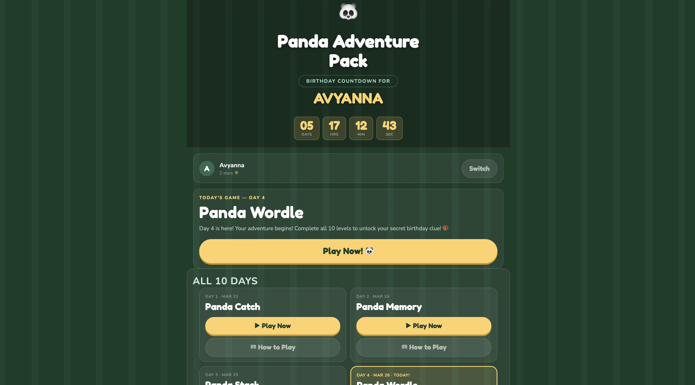

# Birthday Countdown Game Pack 🎮

An **offline-first birthday countdown game platform** — one game unlocks each day, ending on the birthday with a final clue reveal.

Built entirely with **vanilla HTML, CSS, and JS** — no server, no build tools, no npm, no installs. Just open `index.html` and play.

Built with **Claude** (Anthropic) — from architecture decisions to individual game mechanics to this README itself.

---

## Table of contents

- [Demo](#demo)
- [Want to build one for your child?](#want-to-build-one-for-your-child)
- [Quick start](#quick-start)
- [Folder structure](#folder-structure)
- [Architecture](#architecture)
  - [Core guarantees](#core-guarantees)
  - [Script load order](#script-load-order)
  - [Engine overview](#engine-overview)
  - [Game contract](#game-contract)
  - [Local state shape](#local-state-shape)
- [Themes](#themes)
- [Features](#features)
  - [Multi-player support](#multi-player-support)
  - [Best scores](#best-scores)
  - [Sound effects](#sound-effects)
  - [Keyboard input](#keyboard-input)
  - [Accessibility](#accessibility)
  - [Progressive Web App (PWA)](#progressive-web-app-pwa)
- [How to add a new game (Day N)](#how-to-add-a-new-game-day-n)
- [Built with Claude](#built-with-claude)
- [Contributing](#contributing)
- [About](#about)
- [Credits](#credits)
- [License](#license)

---

## Demo

Double-click `index.html` to launch. One game unlocks per day based on the birthday date in `config/app-config.js`.



---

## Want to build one for your child?

See [`REMIX.md`](./REMIX.md) — a fully templated prompt you fill in and paste into any AI coding assistant to generate a custom themed birthday countdown pack.

---

## Quick start

1. Clone or download this repo
2. Open `config/app-config.js`
3. Set `playerName` to your child's name
4. Set `birthdayDate` to their birthday (`YYYY-MM-DD`)
5. Set `activeTheme` to your chosen theme (see [Themes](#themes))
6. Write your clue text for each day (the treasure hunt hints)
7. Double-click `index.html`

No install. No server. Works offline.

For full deployment options (GitHub Pages, Netlify, Vercel, PWA install, sharing by ZIP), see **[DEPLOY.md](./DEPLOY.md)**.

---

## Folder structure

```
birthday-countdown-gamepack/
├── index.html                 ← entry point (registers SW, redirects to launcher)
├── manifest.json              ← PWA manifest
├── sw.js                      ← service worker (offline caching)
├── README.md
├── REMIX.md                   ← remix kit: generate your own themed pack
├── .gitignore
├── config/
│   └── app-config.js          ← ✏️ YOUR CUSTOMIZATION GOES HERE
├── launcher/
│   ├── index.html             ← main UI: countdown, day cards, progress
│   └── launcher.js            ← unlock logic, state, navigation, multi-player
├── engine/
│   ├── panda-adventure.js     ← global namespace bootstrap
│   ├── config-loader.js       ← reads app-config.js
│   ├── state-manager.js       ← localStorage progress, streaks, best scores
│   ├── unlock-engine.js       ← day unlock logic (date-based)
│   ├── game-bridge.js         ← game → launcher completion signal
│   ├── theme-manager.js       ← theme token injection (10 built-in themes)
│   └── sounds.js              ← sound effects engine
├── games/
│   ├── shared/
│   │   └── game-shell.js      ← shared HUD top bar for all games
│   ├── catch.html             ← Day 1: basket catch arcade
│   ├── memory-match.html      ← Day 2: card memory match
│   ├── stack.html             ← Day 3: block stacking
│   ├── wordle.html            ← Day 4: word guessing
│   ├── dressup.html           ← Day 5: tap arcade
│   ├── sudoku.html            ← Day 6: sudoku
│   ├── by-numbers.html        ← Day 7: paint by numbers
│   ├── tetris-mosaic.html     ← Day 8: tetris
│   ├── code-breaker.html      ← Day 9: mastermind / code breaker
│   └── birthday-quest.html    ← Day 10: birthday finale
├── assets/
│   └── css/
│       └── global.css         ← shared CSS design tokens
└── icons/
    ├── icon-192.png           ← PWA icon
    └── icon-512.png           ← PWA icon
```

---

## Architecture

### Core guarantees
- No server required
- No npm, no build step, no installs
- No ES modules (`import`/`export`) — plain `<script>` tags only
- Works offline via `file://` in Chrome and Safari
- Installable as a PWA (Progressive Web App)
- All state stored in `localStorage`

### Script load order

Engine scripts must load in this order (all games follow this pattern):

```html
<script src="../config/app-config.js"></script>
<script src="../engine/panda-adventure.js"></script>
<script src="../engine/config-loader.js"></script>
<script src="../engine/theme-manager.js"></script>
<script src="../engine/sounds.js"></script>
<script src="../engine/state-manager.js"></script>
<script src="../engine/unlock-engine.js"></script>
<script src="../engine/game-bridge.js"></script>
```

### Engine overview

| File | Responsibility |
|------|---------------|
| `panda-adventure.js` | Global namespace `window.PandaAdventure` |
| `config-loader.js` | Reads `window.APP_CONFIG` set by `app-config.js` |
| `state-manager.js` | Progress, streaks, best scores, multi-player via localStorage |
| `unlock-engine.js` | Date-based day unlock logic |
| `game-bridge.js` | Game → launcher completion signal (postMessage + localStorage fallback) |
| `theme-manager.js` | Injects theme CSS tokens into `document.documentElement` |
| `sounds.js` | Sound effects engine (`App.Sounds`) |

### Game contract

Every game signals completion to the launcher using the game bridge:

```js
function completeGame(score, level) {
  App.Bridge.sendComplete({
    type: "GAME_COMPLETE",
    gameId: "day1",   // must match the id in app-config.js
    score: score,
    level: level
  });
}
```

`App.Bridge.sendComplete` stores the payload in `localStorage` and redirects to the launcher. The launcher retrieves it on load. A `postMessage` is also sent for same-window scenarios. Both strategies are handled automatically by `game-bridge.js`.

### Local state shape

```json
{
  "playerName": "YourChildName",
  "progress": {
    "day1": true,
    "day2": false
  },
  "streak": 3,
  "lastCompletedDay": 1,
  "lastUnlockedDay": 2,
  "bestScores": {
    "day1": 420,
    "day2": 18
  }
}
```

State is stored under the key `birthday_adventure_state_v2`. Old keys (`panda_adventure_state_v2`) are automatically migrated on first load.

---

## Themes

Switch theme in `config/app-config.js` by setting `activeTheme`:

| Value | Description |
|-------|-------------|
| `"panda"` | Green bamboo forest |
| `"penguin"` | Deep blue arctic |
| `"transformer"` | Cyber sci-fi |
| `"brainrot"` | Roblox Brainrot aesthetic (tropical blue & neon) |
| `"pirate"` | Treasure hunt on the high seas |
| `"dino"` | Prehistoric dinosaur adventure |
| `"minecraft"` | Pixel block crafting world |
| `"pokemon"` | Pokémon adventure *(bonus — set `activeTheme` to use)* |
| `"unicorn"` | Unicorn magic *(bonus — set `activeTheme` to use)* |
| `"space"` | Galaxy explorer *(bonus — set `activeTheme` to use)* |

All theme data lives exclusively in `engine/theme-manager.js → FALLBACK_THEMES`. No colors, emoji, or strings are hardcoded in game files.

---

## Features

### Multi-player support

Multiple players can share a single device. From the launcher, tap **Switch** to open the player modal where you can:
- Add a new player
- Rename an existing player
- Remove a player
- Switch between players

Each player has their own independent progress, streak, and best scores stored in `localStorage`.

### Best scores

Each game tracks a personal best score per player. Best scores are displayed on completed day cards and persist across sessions via `App.State.saveBestScore()` / `App.State.getBestScore()`.

### Sound effects

Always use `App.Sounds` — never inline `new Audio(...)`:

```js
App.Sounds.play('collect');   // good item caught
App.Sounds.play('hit');       // life lost
App.Sounds.play('levelUp');   // level cleared
App.Sounds.play('win');       // game complete
App.Sounds.play('gameOver');  // all lives lost
```

`engine/sounds.js` must load after `panda-adventure.js` and before the game script.

### Keyboard input

Every game supports pointer (touch/click) and keyboard:

| Game type | Keys |
|-----------|------|
| Catch / Stack / Dressup | `ArrowLeft`, `ArrowRight` |
| Wordle / Code-breaker | Letter keys, `Enter`, `Backspace` |
| Memory Match | `Enter` or `Space` to flip |
| Sudoku | `1–9`, `Backspace` to clear |

### Accessibility

- `prefers-reduced-motion` CSS media query suppresses animations and transitions for users who prefer reduced motion
- `aria-live="polite"` on the today-title element announces day changes to screen readers
- Focus styles preserved throughout for keyboard navigation

### Progressive Web App (PWA)

`index.html` registers a service worker (`sw.js`) that caches all game assets for offline play. After the first load, the pack works with no internet connection. The app can be installed to the home screen on iOS and Android.

---

## How to add a new game (Day N)

1. Create `games/your-game.html`
2. Include shared scripts in `<head>`:
   ```html
   <link rel="stylesheet" href="../assets/css/global.css">
   <script src="../config/app-config.js"></script>
   <script src="../engine/panda-adventure.js"></script>
   <script src="../engine/theme-manager.js"></script>
   <script src="../engine/sounds.js"></script>
   <script src="../engine/game-bridge.js"></script>
   <script src="../games/shared/game-shell.js"></script>
   ```
3. Apply the theme and set shortcuts immediately after:
   ```js
   var cfg = window.APP_CONFIG || null;
   window.__activeTheme = PandaAdventure.Theme.applyFromConfig(cfg);
   var t = window.__activeTheme || {};
   window.__T  = t;
   window.__TI = t.icons   || {};
   window.__TC = t.canvas  || {};
   window.__TS = t.strings || {};
   ```
4. Mount the top bar:
   ```js
   App.GameShell.mountTopBar({ rootId: "game-root" });
   ```
5. Update HUD stats during play:
   ```js
   App.GameShell.setStats({ score, level, lives, timer });
   ```
6. Signal completion via the bridge:
   ```js
   App.Bridge.sendComplete({ type: "GAME_COMPLETE", gameId: "dayN", score, level });
   ```
7. Add a THEME SYNC block at the bottom of `<body>` (see `REMIX.md`)
8. Add an entry in `config/app-config.js` with `id`, `dayNumber`, `file`, and per-theme titles/clues

---

## Built with Claude

This project was built end-to-end using Claude (Anthropic) — architecture, game mechanics, engine design, and this README. The `REMIX.md` file captures the prompt engineering approach so you can reproduce it for any theme or child.

---

## Contributing

Small, focused pull requests are welcome — new themes, new games, accessibility
fixes, typo hunts. The bar is: "would this make the experience better for a kid
and the parent setting it up?"

**Ways to contribute:**

- **New themes** — add a new entry under `FALLBACK_THEMES` in `engine/theme-manager.js`. Copy an existing theme (e.g. `panda`) and swap colors, strings, emojis, and per-day titles/clues. See `REMIX.md` for the theme contract.
- **Bug fixes** — small, focused PRs are easier to review.
- **New games** — each day is a standalone HTML file in `games/`. Signal completion via `App.Bridge.sendComplete()`. Read `REMIX.md` before starting — it documents the game contract.
- **Docs, a11y, performance** — always welcome.

**Before you open a PR:**

- Run locally: `python3 -m http.server 8080` at the repo root, then open `http://localhost:8080/launcher/`
- Test with at least two themes (e.g. `panda` and `pirate`)
- Test with some days locked and with `todayOverride` set to an unlocked date
- Check the browser console for errors
- All text a child can see must be kind, age-appropriate, and slang-free
- Validate and sanitize all user input (see `App.Utils.sanitizePlayerName` in `engine/utils.js`)
- Use `textContent` — never `innerHTML` — unless routing through `App.Utils.sanitizeInstructionHtml`

**Be kind.** This is a project for kids. Harassment, inappropriate content, or
personal attacks will not be tolerated. Concerns can be raised by opening an
issue labelled `conduct`.

For security reports, see [SECURITY.md](./SECURITY.md). Please don't open
public issues for vulnerabilities.

## About

Built in 2026 as a birthday gift — a 10-day countdown where one game unlocks
each day, ending on the birthday with a final clue that leads to a real-world
gift. The architecture prioritizes offline-first play (no server, no build
tools, works from `file://`) with a clean engine contract so themes and games
are interchangeable plugins.

The `REMIX.md` file distils the approach into a templated prompt any parent can
fill in and paste into an AI coding assistant to generate their own themed pack.

## Credits

Fonts (Fredoka One, Nunito) are self-hosted under
[SIL Open Font License 1.1](https://openfontlicense.org). Full list of
credits and licenses in [CREDITS.md](./CREDITS.md).

## License

MIT — clone it, retheme it, give it to your kid. See [LICENSE](./LICENSE).
No attribution required but always appreciated. ⭐
